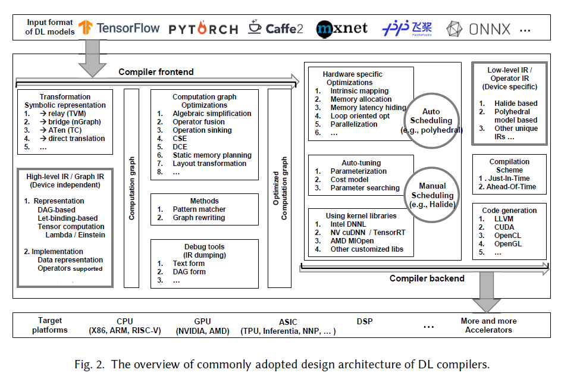

# DLCompilerResource

Note: 同一论文在不同分类目录下可能会出现多次

#### DL编译框架 

- [TVM: An Automated End-to-End Optimizing Compiler for Deep Learning](./pdf/TVM.pdf)

- [Tensor Comprehensions: Framework-Agnostic High-Performance Machine Learning Abstractions](./pdf/TC.pdf)

- [Intel® nGraph™: An Intermediate Representation, Compiler, and Executor for Deep Learning](./pdf/nGraph.pdf)

- [MLIR: A Compiler Infrastructure for the End of Moore’s Law](./pdf/MLIR.pdf)

  > 模块化设计，可以整合不同编译器的DL编译器框架

- [DLVM: A MODERN COMPILER INFRASTRUCTURE FOR DEEP LEARNING SYSTEMS](./pdf/DLVM.pdf)

- [Glow: Graph Lowering Compiler Techniques for Neural Networks](./pdf/GLOW.pdf)

- [Halide: A Language and Compiler for Optimizing Parallelism, Locality, and Recomputation in Image Processing Pipelines](./pdf/halide-pldi13.pdf) 

  > Halide用于图像处理领域的算子生成，首次提出计算和调度分离的思想，后被TVM拓展到深度学习领域

- [Stripe: Tensor Compilation via the Nested Polyhedral Model](./pdf/Stripe.pdf)

  > 用polyhedral进行算子生成

#### survey

- [The Deep Learning Compiler: A Comprehensive Survey ](./pdf/CompilerSurvey.pdf)

> 一篇很好的DL编译器的survey，总结了DL编译器的设计框架

- [An In-depth Comparison of Compilers for Deep Neural Networks on Hardware](./pdf/ComparisonCompiler.pdf)

> 比较了Halide, XLA, TVM, TC等几种编译器的性能

- [UC伯克利AI-Sys课程AI compiler sides](./pdf/dl-compilers.pdf)

  > 依次介绍了Halide/TVM/TC三个工作，勾勒出DL compilers发展的脉络。Halide把调度从硬件的复杂性中抽象出来；TVM自动地为不同硬件优化算子调度；TC为算子全自动代码生成，完全不同考虑硬件。

#### TVM系列工作

- [TVM: An Automated End-to-End Optimizing Compiler for Deep Learning](./pdf/TVM.pdf)
- [Relay: A New IR for Machine Learning Frameworks](./pdf/relay.pdf)
- [Relay: A High-Level Compiler for Deep Learning](./pdf/Relay-Compiler.pdf)

> TVM的第二代high-level IR，类似于编程语言，设计了语法规则，引入了let-binding机制。DL背景的开发者可以使用data flow graph来定义计算图，PL(Program Language)背景的研究人员可以使用let binding来定义计算图。Let binding机制通过compute scope解决了AST的二义性问题。

- [A Hardware-Software Blueprint for Flexible Deep Learning Specialization ](./pdf/VTA.pdf)(VTA)

> TVM设计的一套通用的后端设计方案，设计了指令集，可以基于FPGA实现。VTA与Relay, TVM组成一套完整的end-to-end的DL编译栈。TVM基于VTA尝试了hardware-software codesign.

#### Auto-tuning相关工作

- Automatically tuned linear algebra software(ATLAS, 1998)

- [Halide: A language and compiler for optimizing parallelism, locality, and recomputation in image processing pipelines](./pdf/halide-pldi13.pdf)(2013)

- [OpenTuner: An extensible framework for program autotuning](./pdf/ansel-pact14-opentuner.pdf)(2014)

- [Automatically Scheduling Halide Image Processing Pipelines](./pdf/mullapudi16_halidesched.pdf)(2016)

- [Tensor Comprehensions: Framework-Agnostic High-Performance Machine Learning Abstractions](./pdf/TC.pdf)(2018.2)

- [Learning to Optimize Tensor Programs](./pdf/LearnToOptimizeTensorPrograms.pdf) (Auto-TVM, 2018.5)

- [Learning to Optimize Halide with Tree Search and Random Programs](./pdf/halide_autoscheduler_2019.pdf)(2019)

  下面两篇都是基于TVM做的template-free工作

- [FlexTensor: An Automatic Schedule Exploration and Optimization Framework for Tensor Computation on Heterogeneous System](./pdf/ASPLOS_FlexTensor__ACM_SIGPLAN_Proceedings_Format.pdf)(2020.2)

- [Ansor: Generating High-Performance Tensor Programs for Deep Learning](./pdf/Ansor.pdf)(2020.6)

> 把schedule分成sketch和annotation两层，sketch相当于TVM的schedule template，Ansor可以先搜索出sketch，再搜索annotation。

- [CHAMELEON: ADAPTIVE CODE OPTIMIZATION FOR
  EXPEDITED DEEP NEURAL NETWORK COMPILATION](./pdf/chameleon_adaptive_code_optimization_for_expedited_deep_neural_network_compilation-Original Pdf.pdf)

> 用强化学习来做schedule搜索

#### Polyhedral

- [一.Poly基本原理及卷积分析示例](https://mp.weixin.qq.com/s/QEooKxP1sm5O90AUiqKQEQ)
- [二. Poly在深度学习领域中发挥的作用](https://mp.weixin.qq.com/s/NRtud1UImE5ArZ2zQWFRyg)
- [三. AI芯片上利用Poly进行软硬件优化的一些问题](https://mp.weixin.qq.com/s/bLBIrJb82IsnyoXSEr2xtw)

> 上面面三篇公众号文章介绍Poly的一些基本原理和在DL领域中的应用，作者是要术甲杰，是Poly研究领域的博士

- [Polyhedral编译调度算法(1)——Pluto算法](https://zhuanlan.zhihu.com/p/199683290?utm_source=wechat_session&utm_medium=social&utm_oi=848584440992141312)

> 同样是要术甲杰写的介绍Pluto算法的文章

#### 其他

- [MLIR文章视频汇总](https://zhuanlan.zhihu.com/p/141256429?utm_source=wechat_session&utm_medium=social&utm_oi=837261071604645888&wechatShare=1&s_r=0)

- [Multi-Level Tactics: Abstraction Raising in Multi-Level IR](./pdf/)
- [FUSIONSTITCHING: DEEP FUSION AND CODE GENERATION FOR TENSORFLOW COMPUTATIONS ON GPUS](./pdf/FusionStitching.pdf)

> 用shared memory来实现更激进的operator fusion策略

- [Automatic differentiation in ML: Where we are and where we should be going](./pdf/AutoDiffinML.pdf)
- [Automatic Differentiation in Machine Learning: a Survey](./pdf/AutoDiffSurvey.pdf)

> 两篇关于自动微分的survey

- [IREE: MLIR-based End-to-End ML Tooling](./pdf/IREE Jan 2020 MLIR ODM- External.pdf)

> schedule和execution阶段进行联合优化

- [AI编译优化--总纲](https://zhuanlan.zhihu.com/p/163717035)
- [访存密集算子优化](https://zhuanlan.zhihu.com/p/163857096)
- [计算密集算子优化](https://zhuanlan.zhihu.com/p/174817186)
- [AI编译优化--业务实践](https://zhuanlan.zhihu.com/p/194353051)

> 阿里杨军的系列文章

- [swTVM: Exploring the Automated Compilation for Deep Learning on Sunway Architecture](./pdf/swTVM.pdf)

> 用TVM在神威超算上生成算子 

- [TensorFlow Graph Optimizations](./pdf/TFGraphOptimizationsStanford.pdf)

> TensorFow中的图优化